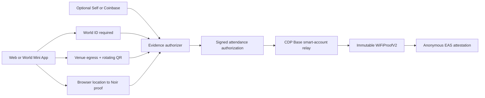

# WiFiProof

**Private proof of presence.** WiFiProof lets an event prove that one unique human completed its venue policy without publishing the attendee's wallet, identity, IP address, or precise device location.

The repository contains two generations:

- **Prototype:** deployed on Base Sepolia at [`0x9EE31e7c48Fe84ad888d4Bf2d5DF809C7E137A4A`](https://sepolia.basescan.org/address/0x9EE31e7c48Fe84ad888d4Bf2d5DF809C7E137A4A). It is wallet-bound and remains for historical demos.
- **V2 release candidate:** implemented as a new immutable contract, hardened Noir circuit, sponsored Base relay, rotating venue challenge, CIDR network validation, anonymous EAS receipt, and private Supabase School pilot. V2 is not represented as deployed until its Safe, schema, relay policy, and security review are complete.

## What V2 proves

The standard event policy requires four independent factors:

1. World ID 4 provides the unique-human gate.
2. The request uses an approved venue public-egress CIDR.
3. A signed venue QR challenge is no more than 60 seconds old.
4. A Noir proof shows that supplied private coordinates are inside the event radius.

Self or Coinbase Verified can be required as an additional credential. Neither replaces World ID.

This is deliberately a narrow claim. Browser code cannot prove an SSID, guarantee honest GPS, prevent device handoff, or defeat a sophisticated live relay. See [SECURITY.md](./SECURITY.md).

## Architecture



Authorization signing and transaction relaying are separate trust boundaries. Production signing uses Lit PKP; the plaintext key path is development-only. Relay jobs are idempotent in Supabase, retry with bounded backoff, and call only `claimAttendanceFor` on the configured V2 contract. A restrictive CDP account policy remains a deployment requirement.

## Assurance levels

| Tier | Intended use | Assessment | Important residual risk |
|---|---|---:|---|
| Venue egress alone | Diagnostic signal only | 3/10 | VPNs, relays, shared NAT and no SSID proof |
| Existing prototype | Historical Sepolia demos | 4/10 | Wallet-bound, weaker operational controls |
| Standard V2 | Conferences, meetups and classrooms | Target 7/10 | Browser GPS spoofing, device handoff, live relaying |
| Future native Octet tier | High-assurance native mobile events | Target 8/10+ for device location | Still does not prove who carried the device |

## Repository

- `packages/web`: Next.js public site, organizer/attendee flows, School product, APIs, separate Events/School database projects, and the pinned Lit Action source.
- `packages/proof-app`: Noir circuit, browser prover and generated circuit artifact.
- `packages/contracts`: immutable V2 contract, generated UltraHonk verifier, deployment scripts and Foundry tests.
- `packages/common`: legacy shared helpers used by the prototype.
- `DESIGN.md`: Signal Field visual source of truth.
- `PRODUCT.md`: product promise, users, claims and content constraints.

## Local setup

Requirements: Node 20+, pnpm 10, Noir/Nargo compatible with the checked-in circuit, Barretenberg `bb`, and Foundry.

```bash
pnpm install
pnpm --filter web dev
```

Copy `packages/web/.env.example` to `packages/web/.env.local`. Events and School intentionally use different Supabase projects and credentials. Keep all server secrets unprefixed; only public browser configuration may use `NEXT_PUBLIC_*`.

```bash
# Events database (server only)
EVENTS_SUPABASE_URL=https://EVENTS_PROJECT.supabase.co
EVENTS_SUPABASE_SECRET_KEY=sb_secret_...

# School database (separate project)
NEXT_PUBLIC_SCHOOL_SUPABASE_URL=https://SCHOOL_PROJECT.supabase.co
NEXT_PUBLIC_SCHOOL_SUPABASE_PUBLISHABLE_KEY=sb_publishable_...
SCHOOL_SUPABASE_SECRET_KEY=sb_secret_...

# Current Lit Chipotle signer
SIGNER_MODE=lit
LIT_NETWORK=chipotle
LIT_USAGE_API_KEY=...
LIT_PKP_ID=...
LIT_PKP_SIGNER_ADDRESS=0x...
LIT_ACTION_IPFS_CID=...
```

Apply Events migrations from `packages/web/supabase-events` and School migrations from `packages/web/supabase-school`; never link both directories to one remote project. In the School dashboard, disable public signup before inviting accounts. A fictional pilot can then be created with:

```bash
pnpm --filter web seed:school
```

The script creates temporary passwords once and forces a password change. It never seeds real institution data.

## Verification commands

```bash
pnpm --filter web lint
pnpm --filter web test
pnpm --filter web build

pnpm --filter @wifiproof/proof-app circuit:test
pnpm --filter @wifiproof/proof-app circuit:compile

cd packages/contracts
forge test --offline
forge build
```

The current suites cover CIDR boundaries, challenge rotation/tampering/expiry, metadata commitments, circuit coordinate and event constraints, contract fees, factor enforcement, proof and policy mismatches, replay protection, signer rotation, pausing, anonymous EAS payloads, fuzzed fees, and the fee-custody invariant.

## Deploying V2

`packages/contracts/script/DeployV2.s.sol` deploys a fresh verifier and immutable protocol. Configure Base USDC, EAS, the EAS schema, treasury, authorizer, CDP relay address, and a 2-of-3 Safe owner. The default event fee is `5_000_000` USDC base units.

```bash
cd packages/contracts
forge script script/DeployV2.s.sol --rpc-url base-sepolia --broadcast
```

Before mainnet, configure the CDP account policy to reject every network, destination, value, and method except the intended Base network and V2 `claimAttendanceFor` call. Complete an independent contract/security review and the release gates in [SECURITY.md](./SECURITY.md).

The complete numbered service setup, migration, Safe, EAS, Lit, CDP, deployment, and Playwright instructions are in [docs/SETUP.md](./docs/SETUP.md). The current Lit migration decision and rotation steps are in [docs/LIT_MIGRATION.md](./docs/LIT_MIGRATION.md). The 13-layer code and operations assessment is in [docs/ARCHITECTURE_AUDIT.md](./docs/ARCHITECTURE_AUDIT.md).

## Now / Next / Later

**Now:** Signal Field landing page, canonical `/school`, invite-only Supabase Auth/RLS, exact CIDR checks, rotating challenges, World-required receipts, hardened circuit, immutable fee contract, anonymous receipts, and idempotent CDP relay code.

**Next:** apply migrations to the production project, provision registered event-scoped World actions, configure Safe/EAS/CDP policies, run full Supabase RLS and Playwright environments, pilot on Base Sepolia, and obtain an independent review.

**Later:** Base mainnet pilot, World Store submission, aggregate School anchoring, public verification API, and a native Octet hardware-backed location tier. Octet is documented in [docs/OCTET.md](./docs/OCTET.md) and is not part of the browser V2 claim.

## License

[MIT](./LICENSE)
